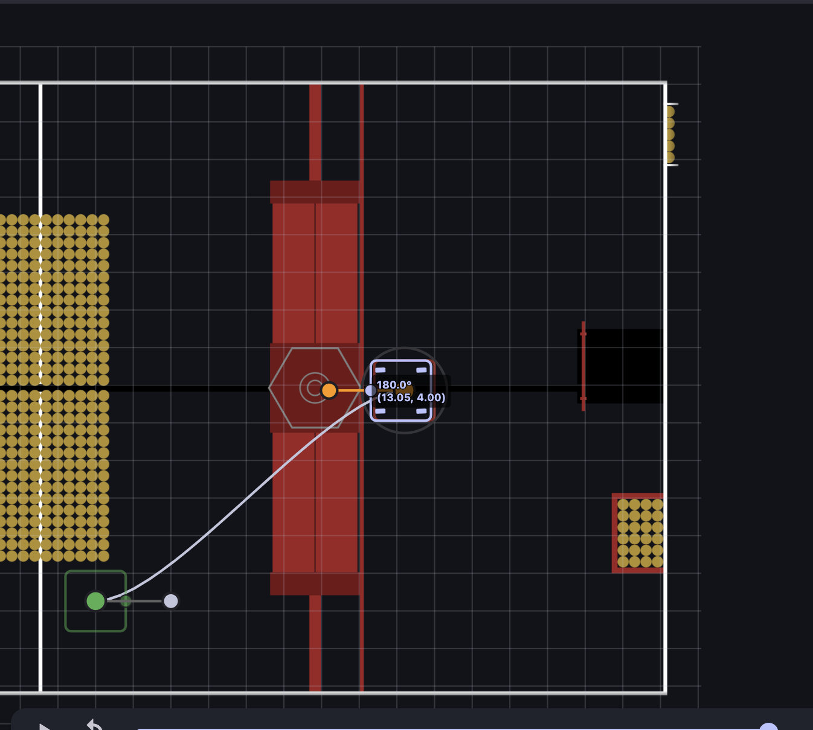
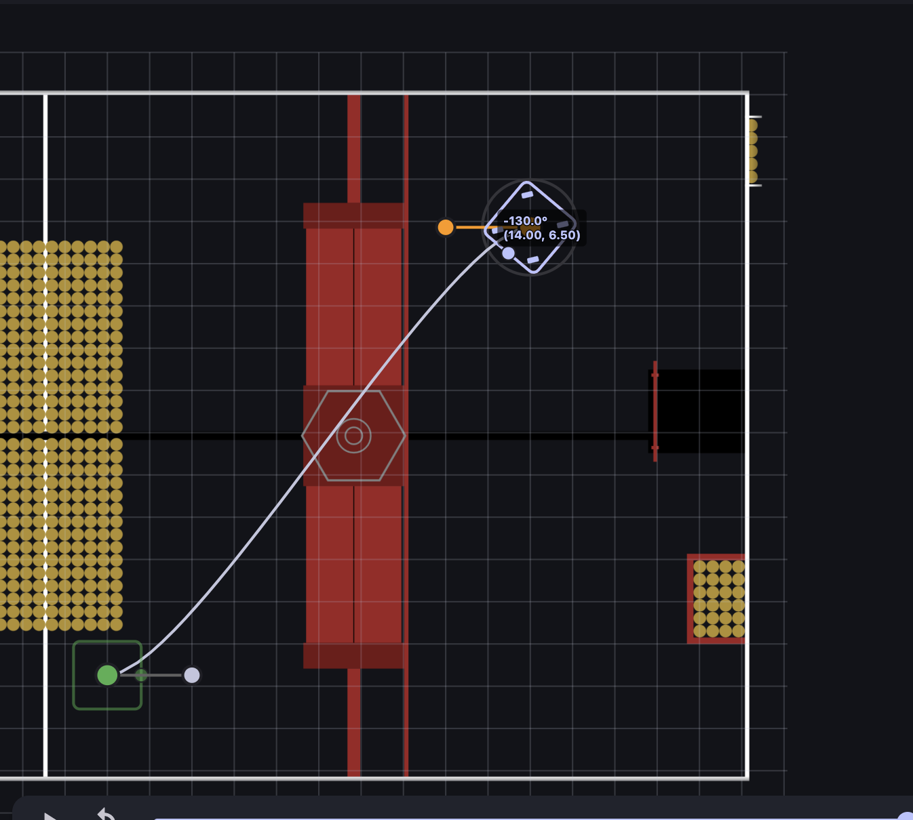

TODO LIST:

1. Pitching Limit retesting
2. Velocity Preset test

deploy method

1. clone the project
2. connect the robot to DS (the program will restart rapidly unles DS connected)
3. run ./gradlew build(linux) or gradlew.bat build(windows)

field reset: drive to outpost and hit the field reset button